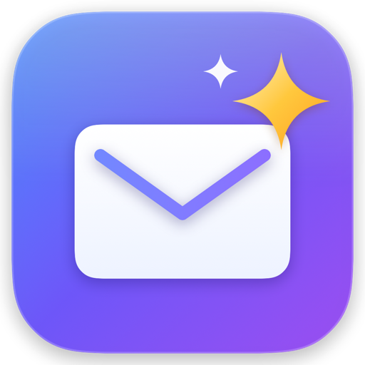
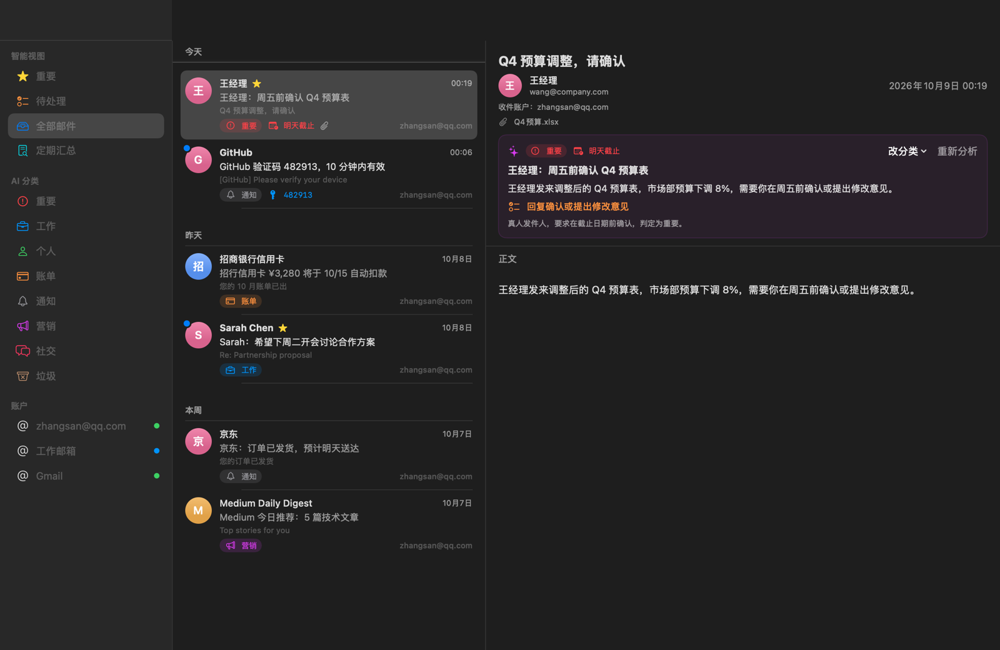
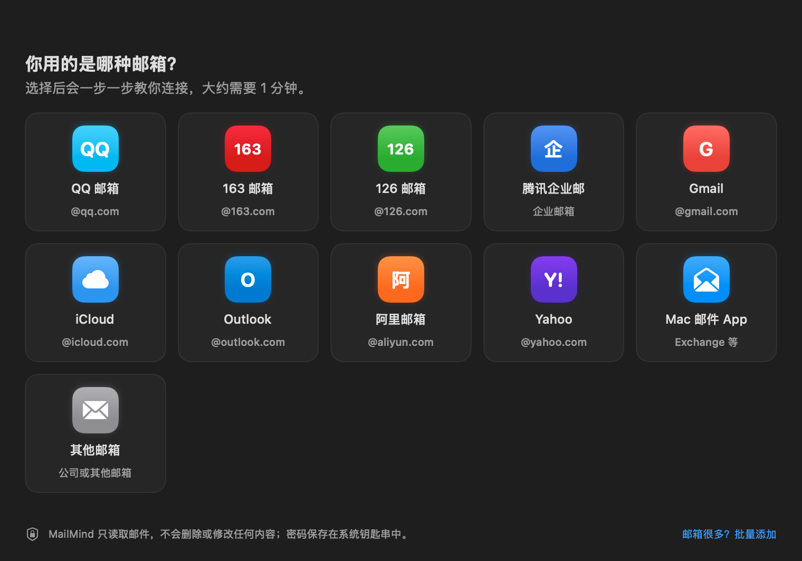
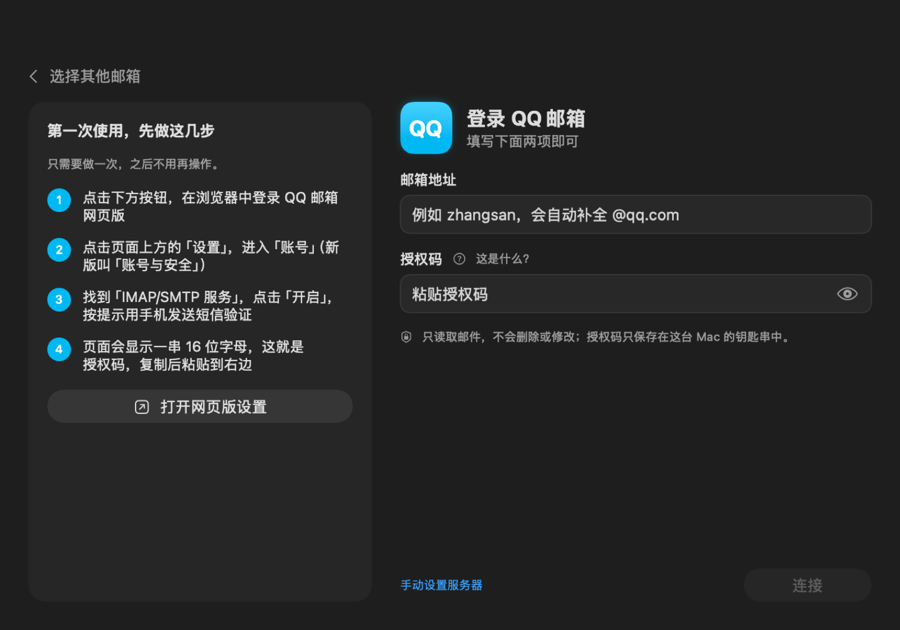
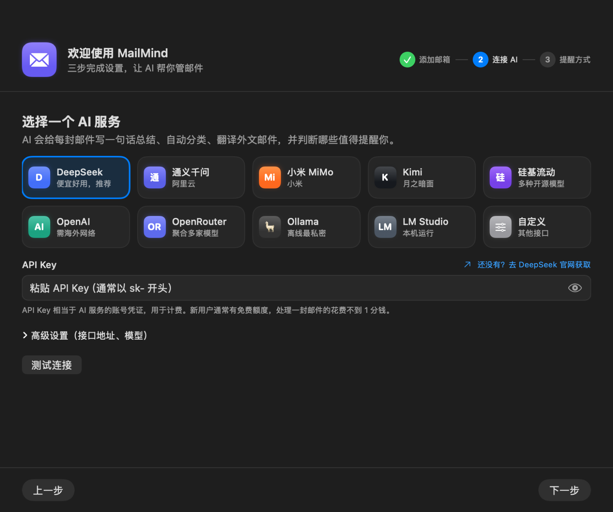
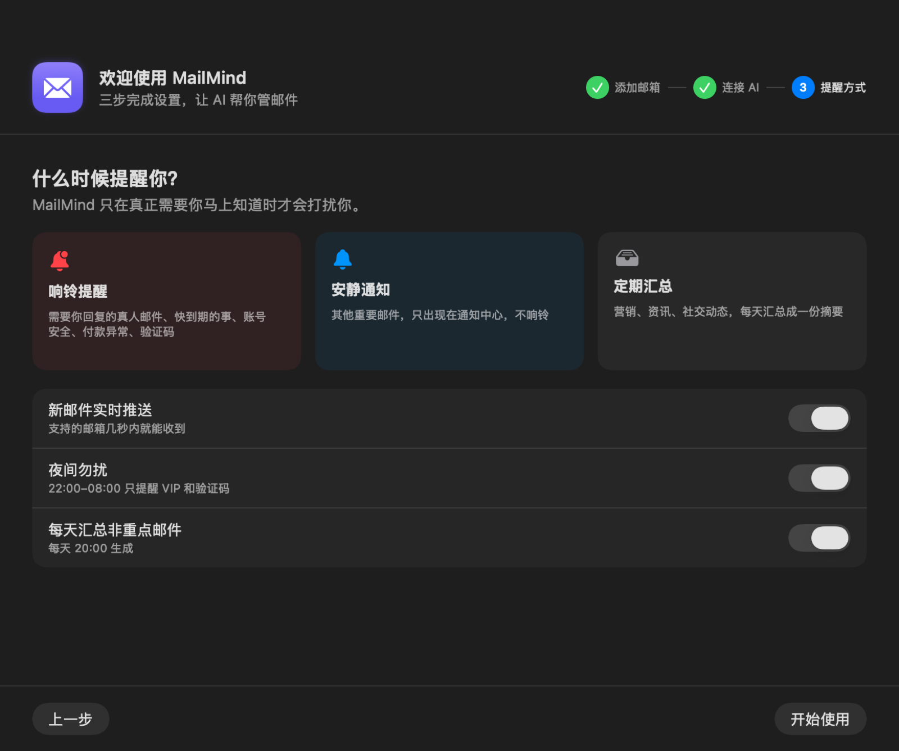

<div align="center">



# MailMind

**开源的 macOS 原生 AI 邮件管家**

所有邮箱放在一处，AI 帮你读完每一封：<br>
重要的马上提醒，不重要的定期汇总，外文邮件自动翻译。


</div>

<br>



## 为什么做 MailMind

邮箱一多，问题就来了：垃圾邮件、营销邮件、各种通知淹没了真正重要的那几封；外文邮件要复制去翻译；每个邮箱都要单独打开看一遍。

MailMind 让 AI 替你把关：

- 📌 **只在真正需要时打扰你** —— 老板要你周五前回复、信用卡扣款失败、验证码，这些会响铃；其他重要邮件安静地放进通知中心；营销和资讯类邮件，每天晚上汇总成一份摘要
- ✍️ **一句话看懂一封邮件** —— 「王经理：周五前确认 Q4 预算表」「招行信用卡 ¥3,280 将于 10/15 自动扣款」
- 🌐 **外文邮件自动翻译** —— 英文、日文邮件打开就是中文

## 功能

| | |
|---|---|
| 📮 **多邮箱统一管理** | QQ、163、126、腾讯企业邮、Gmail、iCloud、Outlook、阿里、Yahoo 及任意 IMAP 邮箱；可批量添加 |
| 🧭 **小白也能添加邮箱** | 选择邮箱品牌 → 跟着图文步骤开启 IMAP → 粘贴授权码，出错时用大白话告诉你怎么办 |
| 🔐 **Outlook 也能用** | 三种方式任选：通过 Mac 自带「邮件」App 读取（推荐，无需任何注册）、自动转发到已接入的邮箱、微软账号 OAuth 直连 |
| 📥 **读取 Mac 邮件 App** | 「邮件」App 中的 Outlook、Exchange 等账户可直接接入，MailMind 接触不到你的密码 |
| ⚡ **实时推送** | 支持 IMAP IDLE 的邮箱新邮件秒级到达；其他邮箱每 5 分钟检查；Mac 唤醒后立即补拉 |
| 🤖 **AI 理解每封邮件** | 8 种分类、重要程度、一句话总结、待办事项、截止日期、验证码提取、全文翻译 |
| 🔔 **克制的通知** | 响铃 / 静默 / 不通知三档；夜间勿扰、VIP、静音发件人；一次来多封自动合并 |
| 💬 **问 AI（⌘K）** | 「这周有哪些账单要付？」—— 回答附带可点击的原邮件 |
| ✉️ **AI 起草回复** | 一句话说明意图，生成与原邮件同语言的回复 |
| 📰 **定期汇总** | 每天 / 每周把非重点邮件整理成摘要，并建议哪些可以退订 |
| 🧠 **越用越懂你** | 「以后这个发件人都归为营销」，命中规则时不再调用 AI，省钱又准确 |
| 🧩 **AI 服务随你选** | DeepSeek、通义千问、小米 MiMo、Kimi、硅基流动、OpenAI、OpenRouter，或用 Ollama 完全本地运行 |
| 🍎 **原生、轻量** | SwiftUI 编写，菜单栏常驻，零第三方依赖 |

## 截图

<table>
<tr>
<td width="50%"><br><sub><b>添加邮箱</b>：选择你用的邮箱</sub></td>
<td width="50%"><br><sub><b>图文引导</b>：每个邮箱都有专属步骤</sub></td>
</tr>
<tr>
<td><br><sub><b>连接 AI</b>：选服务商，粘贴 API Key</sub></td>
<td><br><sub><b>提醒方式</b>：只在真正需要时打扰你</sub></td>
</tr>
</table>

## 安装

需要 **macOS 14 Sonoma** 或更高版本，以及 **Xcode 15+**。

```bash
git clone https://github.com/no1coder/mailmind.git
cd mailmind
make run        # 编译并启动
make install    # 安装到「应用程序」文件夹
```

首次启动会出现三步设置向导：**添加邮箱 → 连接 AI → 选择提醒方式**。

> 💡 每次重新编译后第一次读取钥匙串，macOS 可能询问是否允许访问，点「始终允许」即可。

## 通知规则

MailMind 由 AI 判断每封邮件的紧急程度，再结合你的设置决定是否打扰你：

| | 什么邮件 |
|---|---|
| 🔔 **响铃** | 真人发来、需要你回复的邮件 · 48 小时内截止的事项 · 账号安全异常 · 付款失败或异常扣款 · 15 分钟内的验证码 · VIP 发件人 |
| 🔕 **静默** | 其他重要邮件，只进通知中心，不响铃 |
| 📰 **进汇总** | 营销、资讯、社交动态、普通通知 |
| ✖️ **不通知** | 垃圾邮件 · 已在其他设备读过 · 超过 24 小时 · 静音的发件人 |

夜间勿扰（默认 22:00–08:00）时只有 VIP 和验证码会响铃。一次超过 3 封会合并成一条通知。

通知标题就是 AI 写的一句话总结，验证码邮件可以直接在通知上「复制验证码」。

## 快捷键

| 快捷键 | 功能 |
|---|---|
| `⌘K` | 问 AI |
| `⌘R` | 立即同步 |
| `⌘1` – `⌘4` | 重要 / 待处理 / 全部邮件 / 定期汇总 |
| `⇧⌘U` | 标为已读 / 未读 |
| `⌥⌘A` | 全部标为已读 |
| `⇧⌘D` | 生成邮件汇总 |

## 隐私与安全

- **只读**：MailMind 不会删除、移动或修改服务器上的任何邮件，也不会把邮件标为已读
- **读取「邮件」App 需要授权**：只有选择「通过 Mac 邮件 App」接入时，才需要在系统设置中给 MailMind「完全磁盘访问权限」；MailMind 只读取你选择接入的账户的收件箱
- **密码保存在钥匙串**：邮箱密码、授权码、API Key、OAuth 令牌都保存在 macOS 钥匙串中
- **防追踪**：HTML 邮件禁用 JavaScript，默认屏蔽远程图片（追踪像素）
- **AI 数据流向**：使用云端 AI 时，邮件的发件人、主题和正文（截断至 8000 字）会发送到你选择的 AI 服务。介意的话可以使用 [Ollama](https://ollama.com) 在本机运行模型，数据不离开你的电脑
- **不收集任何数据**：MailMind 没有服务器，没有统计，没有追踪

## 架构

```
Sources/MailMind/
├── App/        应用入口、菜单栏、截图工具
├── Mail/       IMAP 客户端（Network.framework）、MIME 解析、服务器自动识别、OAuth
├── AI/         OpenAI 兼容客户端、分类 / 总结 / 翻译 / 汇总 / 问答提示词
├── Storage/    SQLite 本地库、钥匙串、设置
├── Services/   同步引擎、实时推送、通知策略、全局状态
└── Views/      SwiftUI 界面
```

```
IMAP（IDLE 推送 / 轮询）→ MIME 解析 → SQLite → AI 分析 → 通知策略 → 通知 / 汇总 / 界面
```

- **零依赖**：IMAP 协议、MIME 解析（含 GBK / GB2312 等中文编码）、SQLite 封装均为自行实现
- **本地数据**：`~/Library/Application Support/MailMind/mailmind.sqlite`

## 开发

```bash
swift build                                  # 编译
swift test                                   # 单元测试
MAILMIND_NETWORK_TESTS=1 swift test          # 包含真实网络的测试
swift run MailMind --snapshot ~/Desktop/shots  # 离屏渲染界面截图
swift scripts/make-icon.swift build/icon     # 重新生成 Logo 和图标
```

Outlook 的「微软账号直连」需要在微软注册应用，见 [docs/microsoft-oauth.md](docs/microsoft-oauth.md)；不想注册可以用「通过 Mac 邮件 App」或「转发」方式。

## 路线图

- [x] 多邮箱 IMAP 同步、实时推送
- [x] AI 分类、一句话总结、翻译、智能通知
- [x] 问 AI、AI 起草回复、定期汇总
- [x] 引导式添加邮箱、批量导入
- [x] Outlook：Mac 邮件 App 读取 / 转发 / 微软账号 OAuth
- [ ] 一键退订（List-Unsubscribe）
- [ ] 垃圾邮件移入服务器垃圾箱、已读状态同步回服务器
- [ ] 多文件夹同步
- [ ] 内置撰写与发送（SMTP）
- [ ] 附件下载与预览
- [ ] 签名、公证，Homebrew Cask 安装

## 参与贡献

欢迎提交 Issue 和 Pull Request！特别欢迎：

- 补充或修正各邮箱开启 IMAP 的步骤（邮箱网页版改版后菜单名称可能变化）
- 新的邮箱服务商预设、AI 服务商预设
- 改进 AI 提示词，让分类和通知判断更准确

## 许可证

[MIT](LICENSE)
